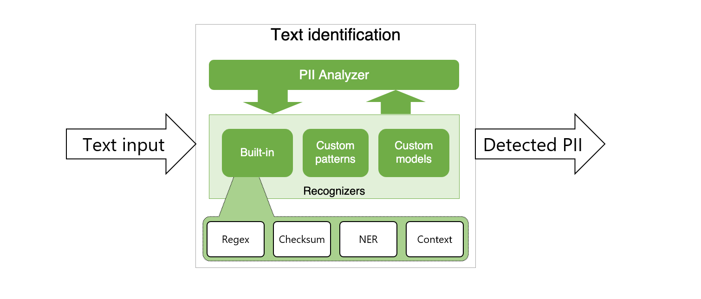
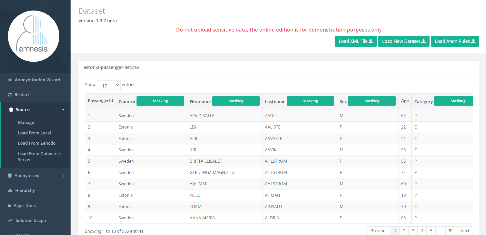

# RoG: A Pipeline for Automated Sensitive Data Identification and Anonymisation
> § The Ring of Gyges was a magic ring mentioned by the philosopher Plato; it gives its owner the power to become invisible at will.

  

Nowadays, the amount of data available online is constantly increasing. This data may contain sensitive or private information that can expose the person behind the data or be misused by malicious actors for identity theft, stalking, and other nefarious purposes. Thus, there is a growing need to protect individuals’ privacy and prevent data breaches in several application domains. This is where **RoG** comes in.

_________________

## What is RoG?
Protecting data privacy is a complex and multifaceted process which involves a range of legal, ethical, and technical considerations. Protecting
sensitive data is not trivial, as there are two significant challenges: 
1) ***Data Volume***: A vast amount of data is generated
2) ***Data Diversity***: Data in various formats is produced

It is though, difficult to manually identify and protect all types of sensitive data. Therefore, after assessing the challenges associated with data protection, the role of automated tools, and the effectiveness of identifying and anonymising sensitive data, we came up with **RoG**, a **fully-automated** pipeline for ***sensitive data identification*** and ***anonymisation***.

The *usefulness* of the RoG anonymization pipeline lies in the following features:
* ***Fully-automated anonymization***: RoG requires no or minimum customization
* ***No data science knowledge required***: RoG provides a layer of abstraction over more intricate analysis and anonymization processes
* ***Effective on a wide range of domains***: RoG incorporates versatile PII entity recognition methods 

_________________

## A deeper look into RoG
Based on the existing literature and taking into consideration the breadth of the entity recognition and data anonymisation research fields, our interest was steered towards developing a NLP-based pipeline, which would automatically identify personal/sensitive information in a given dataset and facilitate its
anonymisation. To this end, (i) the ***Presidio Analyzer***, along with (ii) the ***Amnesia API*** were identified as two suitable candidates to be used in the proposed approach. 

### Sensitive Data Identification

_________________

Sensitive data identification involves identifying and categorising data based on its potential privacy implications. As mentioned above, ***Presidio Analyzer*** served the role of sensitive data identification.

***Presidio analyser*** is a popular open-source tool and part of the Microsoft Presidio software, which can be used to identify and classify sensitive data, such as ***Personally Identifiable Information (PII)***, ***Protected Health Information (PHI)***, and financial information. This tool harnesses a range of techniques, including: 

* ***Named Entity Recognition (NER)***,
* ***Regular Expressions***,
* ***Rulebased Logic***,
* ***Blacklisting***,
* ***RFC-822 validation*** and
* ***checksum***,

aiming to identify predefined and custom PII.

  

### Sensitive Data Anonymization

_________________

Data anonymization refers to the process by which personal data is altered in such a way that a data subject can no longer be identified directly or indirectly, either by the data controller alone or in collaboration with any other party. Data anonymisation may include methods such as ***masking***, ***generalization***, and ***perturbation***, which help to remove or obfuscate personally identifiable information. To this end, the ***Amnesia REST API*** was utilized.

***Amnesia*** is a tool developed by the OpenAIRE infrastructure, which enables the full or partial, if instructed, transformation of personal information to anonymous data. The provided REST API enables the programmatic implementation of data anonymisation tasks via HTTP requests to and from the locally running
Amnesia server. The basic idea is to replace unique values or unique combinations of values with more abstract ones, so that the resulting data will no longer be personally identifiable.

  

### End-to-End Workflow

_________________

Taking a deeper look into the functionality of the proposed pipeline, the workflow is divided into the following three successive phases:

#### 1. Analysis
This stage includes the analysis of the selected data file to automatically detect sensitive or personal data. The process is implemented iteratively for each property of the given dataset and can be unfolded into the following steps:

1. For each dataset attribute, the ***Presidio BatchAnalyserEngine*** module loads the column as a text phrase

2. The BatchAnalyserEngine analyses each column and replaces PIIs with more general values

    > Presidio analyser supports a wide range of recognisable PII entities, such as PERSON, DATE TIME, EMAIL ADDRESS or CREDIT CARD

3. The most frequent PII entity is calculated for each column

4. If the most frequent PII is present in more than 50% of the column cells, column is considered personal/sensitive
   
    > Higher threshold values would lead to less attributes being labeled as sensitive

The analysis results of each dataset attribute are stored in a Pandas DataFrame, which forms the touchstone of the anonymisation stage. An example instance of the DataFrame is shown in the following table. 

| attributeName | attributeType | mostFrequentEntityType | percentage |
| :----: | :----: | :----: | :----: |
| attr1 | string | PERSON | 0.86 |
| attr2 | string | EMAIL_ADDRESS | 1.00 |
| ... | ... | ... | ... |
| attrN | date | DATE TIME | 1.00 |

***Note:*** The **attributeType** field serves the process of mapping the different identifiable PII entities and Python data types to the recognised data types by Amnesia.

| df.dtype | attributeType |
| :----: | :----: |
| object OR category OR bool | string |
| int64 | int |
| float64 | double |
| datetime64 | date |

#### 2. Preparation for anonymization
The automated mechanism deals with the inability of Amnesia to load datasets that contain whitespaces. Here, the given dataset is automatically cleaned off of spaces and is routed towards the anonymisation stage.

#### 3. Anonymization
During this stage the preprocessed version of the given dataset is passed to the Amnesia REST API, along with the metadata of the identified sensitive columns. The foundation of data anonymisation in Amnesia is **generalisation hierarchies**.

> Generalization hierarchies are a set of rules that define how specific values should be substituted by more general ones in the anonymisation process.

The generalisation hierarchy which defines how these replacements take place is provided by the user as input to the algorithm.

| attributeType | Hierarchy classes |
| :----: | :----: |
| string | Distinct, Masking |
| date | Distinct, Range |
| int | Distinct, Range |
| double | Distinct, Range |

Additionally, users are given the capability of configuring a handful of parameters that are of high significance for the proper function of Amnesia via the ***pipeline-config.properties*** file:

* **K:** The k-anonymity factor that refers to the number of times each combination of values appears in a data set
* **FANOUT:** It refers to the number of children for each hierarchy tree
* **STRING_ANON_METHOD:** It refers to the way Amnesia handles and anonymises strings
  
    > The available options are distinct (for replacement of text values by random variables) and mask (for masking text values)

* **MASK_LENGTH:** Used in cases when the masking method is utilised for anomynisation and refers to the number of the mask characters

Considering the previous, the anonymization process of RoG can be unfolded into the following steps:

1. For each dataset attribute, an anonymization hierarchy is created

2. Each hierarchy is loaded to Amnesia REST API

3. Each hierarchy is binded with the coresponding attribute

4. Each attribute/column is anonymized

    > Amnesia REST API produces a plethora of anonymisation solutions that guarantee k-anonymity. However, RoG uses the least strict anonymisation solution so that the interpretability of the dataset is preserved as much as possible
    
5. Anonymized attributes/columns are merged into the raw dataset

The following table provides examples of data for which k-anonymity has been ensured:

| Age | Zip Code | Nationality |
| :----: | :----: | :----: |
| <30 |  130** | * |
| >=40 | 1485* | * |
| 3* | 130** | * |

_________________

## User Manual

### Prerequisites
### How to use RoG?

## Future Work
This work can be considered as a first step towards building a fully-featured anonymisation application, with which users will interact via a friendly interface and will be able to fully automatically and efficiently anonymise any given dataset.

## Contribution
The RoG pipeline is part of our work [RoG: A Pipeline for Automated Sensitive Data Identification and Anonymisation](https://users.uop.gr/~trifon/papers/pdf/ds4cs23-NVZVTR.pdf). This work was supported in part by project [ENIRISST+](https://enirisst-plus.gr/) under grant agreement No. MIS 5047041 from the General Secretary for ERDF & CF, under Operational Programme Competitiveness, Entrepreneurship and Innovation 2014-2020 (EPAnEK) of the Greek Ministry of Economy and Development (co-financed by Greece and the EU through the European Regional Development Fund).

## Find us:

